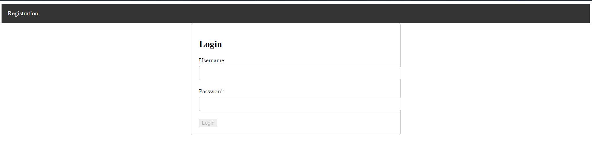
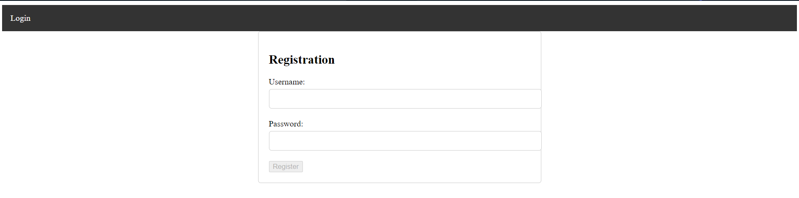
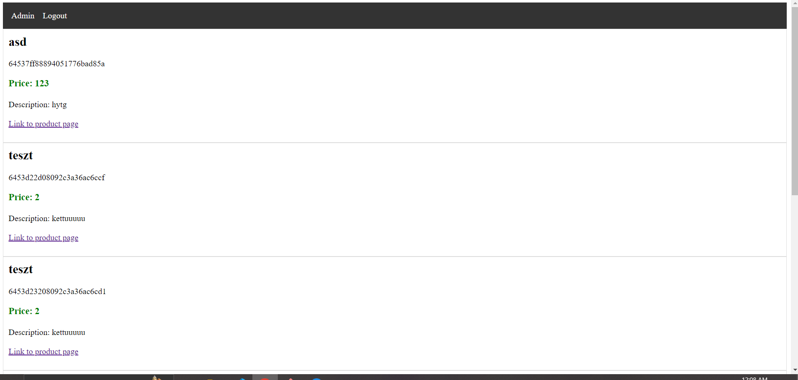
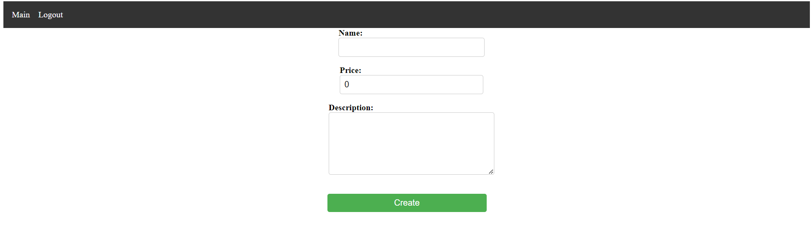
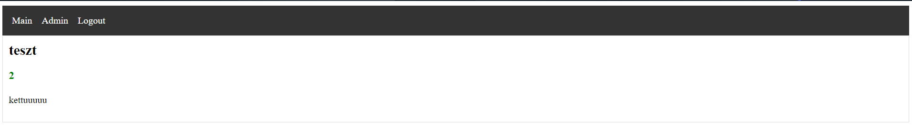
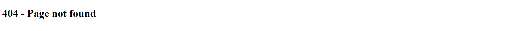

# Szia Heló, ezt olvasd el lécike, jól jársz vele ;)
Ez szeretne lenni a kért doksi. igyekszem csak a lényeget leírni :D

## Előkészületek

### Adatbázis 
Az adatbázist a projekt könyvtár gyökerében kiadott `docker compose up -d` segítségével tudod elindítani. 

### Backend
Ugyanúgy a projekt könyvtár gyökerében kelleni fog egy `npm install`.

### Frontend

Ey már húzósabb, itt bele kell menni a `frontend2` nevezetű mappába (igen azért 2 mert az 1 rossz volt :( ), amit a projekt könyvtár gyökerében találsz. Itt is kelleni fog egy `npm install`. Valamint ezen kívül le is kell buildelned a frontendet, szóval még egy `ng build` is kelleni fog.

## Futtatás

A futtatásnak ezután már működnie kell, ehhez csak ki kell adnod a `node app.js` parancsot a projekt könyvtár gyökerében. 

## Fejlesztési dokumentáció
A fejlesztés sorrán nem gyűjtögettem ki egyesével a logokat szóval csak pár kulcs mondatban, hogy mi is történt:
- 2023.05.02.:
     A backend egy az egyben az órai kódokból áll, egyedül csak a productSchema az amit hozzá tettem és a hozzá tartozó routing.
- 2023.05.03-04.: A frontend viszont teljes mértékben egyedi és én csináltam. Ennek fejlesztéséről pár szó:
    * Itt semmi értelme nem volt használni az órai kódokat, mivel mindegyike hibát dobott nekem. 
    * Szóval a nulláról buildeltem egy új angulár projektet routinggal hozzá, amelyhez később létrehoztam 6 komponenst (ezek lettek az oldalaim), 3 servicet és 1 modellt. 
    * Mindegyik oldal/komponens rendelkezik megfelelő tartalommal, navigációval, valamint authguarddal is. 
    * A servicekbe külön kiszerveztem a backenddel való kommunikációt, ahol annak végpontjait hívogattam meg. 

## Projekt dokumentáció
Az oldal futtatás után egyből elérhető lesz. Alapjáraton a 3000-es port van megadva szóval  ha nem változtattad meg, akkor [ide kattintva](http://localhost:3000) oda is navigálhastz.

Ha be vagy jelentkezve, akkor alapjáraton a főoldalra kell kerülnöd, de ha nem, akkor az authguard miatt a login felületen találod magad, ami így néz ki. Itt akár be is jelentkezhetsz az induláskor létrehozott admin felhasználóval is: `username:admin, password:admin123`. De létre is hozhatsz magadnak egy új felhasználót a regisztrációs felületen.
Bejelentkezést/regisztrációt követően átkerülsz a főoldalra, ahol a termékek vannak kilistázva, de ha üres, akkor nyílvánvalóan nincs egyetlen egy terméked sem az adatbázisban.  Ehhez navigálj át az admin felületre (Amit persze nem csak adminok használhatnak, mert hát nem volt a feladat része, hogy arra is figyeljünk) és hozz létre egy új terméket. Gombnyomást követően létre fog jönni a termék, arra viszont figyelj, hogy nincs redirect (lusta voltam már megcsinálni lol), szóval magadtól kell visszamenned a föoldalra. Ezután már látnod kell a termékedet és annak részleteit. Itt van is egy link, ahol át tudsz menni egy másik oldalra, ahol kevesebb információt látsz a termékedről (jó sok értelme van, mi? :D). .
Ja és végül de nem utolsó sorban, a logout is persze működik, azt is kipróbálhatod.
Meghát a not-found oldalt is kihagytam, amit egy hibás route-tal lehet elérni, pl mint ez: `localhost:3000/jozsi`.

Köszi ha végig olvastad, de ha nem és csak ezt az egysort olvastad el, akkor is! ;)